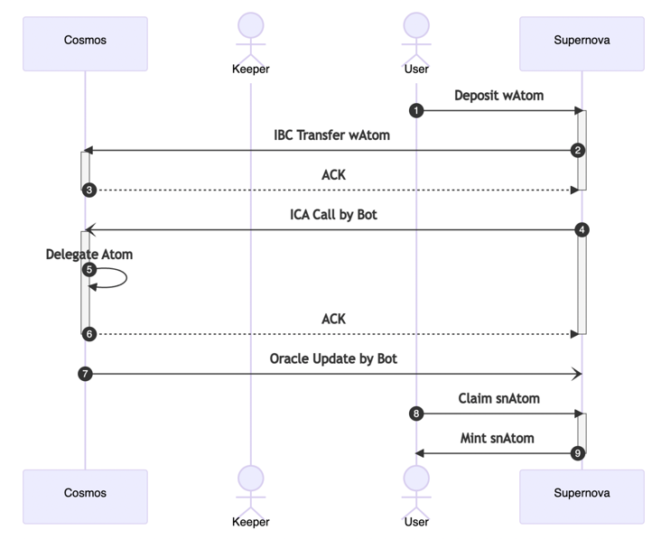
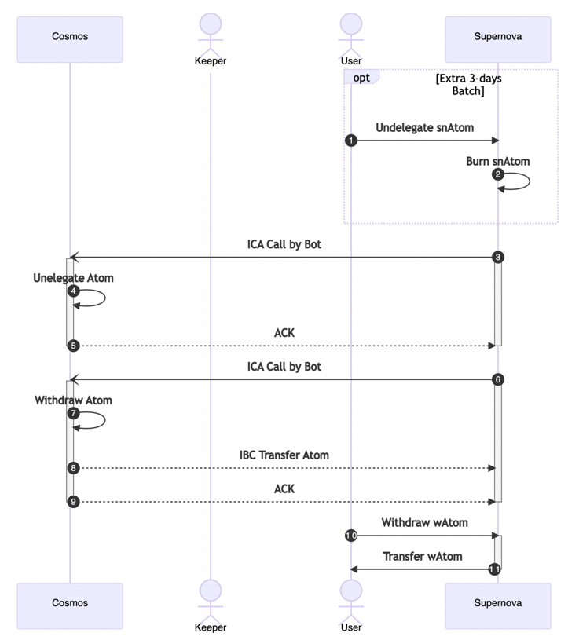

# Core Concept

---

## Overview

---
The **gal(general asset liquidation)** module is a module that stores and manages the status of asset deposits and withdrawals through the Supernova service. The gal module allows the user to remotely delegate or undelegate assets that exist in the Supernova chain.
This document describes how the gal module liquidates your assets.

## Flow
1. User deposit their asset, for example atom. GAL module records the amount of coin and address, but not delegate immediately. The deposition state at this time is called `DepositRequest`
2. The assets are transferred to the Host address of the other chain for delegation through ICA. The deposition state at this time is called `DepositSuccess`.
3. Assets recorded in the deposit record are periodically delegated using ICA. The reason for not delegating immediately is that 
it is difficult to track assets delegated to different chain validators in real time. After submit ICA delegation transaction, the deposition state is called `DelegateRequest`.
4. If ICA delegation is success, the deposition state is called `DelegationSuccess`.
5. The service bot periodically compounds interest.
6. The user can claim equity tokens for the assets that he or she has claimed. This equity token, we call it `sn-token`.(For example, `sn-atom`.)
At this time, a method that allows the user to manually claim to minimize damage to the protocol is called **Lazy mining**.
7. Equity tokens can be exchanged for their corresponding pair tokens on Supernova's decentralized exchange. (For example, atom-snAtom.) 
At this time, we came up with a method called Staked-swap to keep the exchange cost as constant as possible.
8. If the user wants to return the equity token, he or she must apply for the undelegation. 
At this time, the amount of coins that can be received is calculated relative to the total tokens delegated to the counterpart chain and the equity tokens that are incinerated based on the user's shares.
9. The undelegation job that you applied for is not immediately delivered to the other chain, but is recorded in Supernova.
This is because the Cosmos-based blockchain typically has a limit on the number of undelegation applications (usually 10 cases) and the undelegation state in this state is called `UNDELEGATE_REQUEST_USER`.
10. The undelegation application is collected and processed once every 2-3 days. The undelegation state for this state is called `UNDELEGATE_REQUEST_ICA`.
11. Assets that have been undelegated are transferred to the `WithdrawStatusRegistered` state. This asset is periodically transferred to the Supernova chain as an ICA transfer operation.
12. Undelegated assets transferred to the Supernova chain will be transferred to the `WithdrawStatusTransferred` state, allowing the user to withdraw directly.

## Detail of Flow
### Deposit and Claim sn-Token

Assets requested by the user are transferred to the counterpart chain via **IBC transfer**.

When an `ACK` for IBC transfer is received from Supernova, it attempts to delegate remotely through **ICA**. 

Upon successful remote delegation and receiving an `ACK`, the user can claim the equity token based on the latest Oracle version.

### Undelegate and Withdraw

In order to apply for the release of delegation, the equity token must be incinerated. Information about the retired equity token and the actual withdrawal amount will be recorded until the withdrawal is completed.

Request for release of delegation is collected once every three days and executed.

Assets that have been decommissioned are transferred from the counterpart chain to the Supernova chain using ICA transfer, and the user can withdraw this amount.